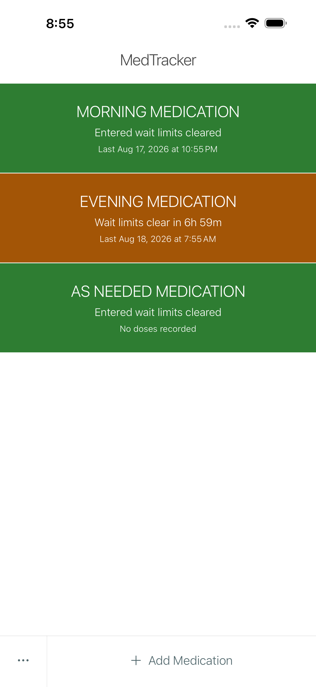
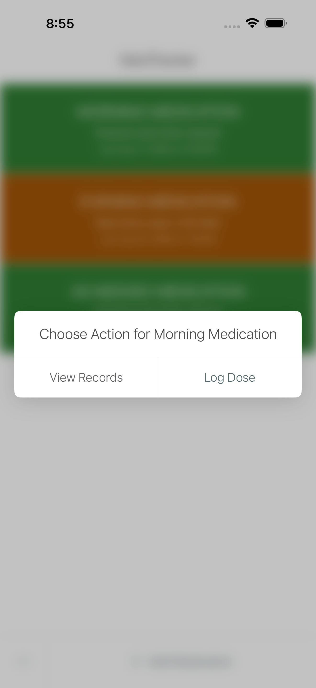
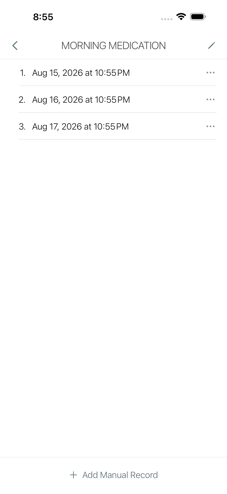

# Medication Tracker

A private, offline medication tracker available as a Progressive Web App and a native SwiftUI app for iPhone and iPad. Data is stored locally on the device.

<p align="center">
  
  
  
</p>

**Access the App:** <https://thngkaiyuan.github.io/medication-tracker/>

*Development history: The original PWA structure was created with Claude Sonnet 4 and substantially refined with Google’s Gemini 2.5 Pro. The native SwiftUI app, cross-platform compatibility hardening, automated coverage, and App Store preparation were developed with OpenAI Codex. Final product decisions and releases are maintained by the repository owner.*

## Overview

This application provides a user-friendly interface to:
* Add, edit, and delete medications with custom schedules.
* Log when you take a dose via a simple click/tap interface.
* View a clear, chronologically sorted history of when each medication was taken, with newest entries auto-scrolled into view.
* Edit or delete individual past record entries.
* Add historical/manual dose records.
* See at a glance when your entered minimum interval and optional rolling 24-hour limit have cleared, using color-coded tiles.
* Manage your medication data through local export and import for backup.

The app is designed primarily for mobile touch interaction but is functional on desktop browsers as well.

## Features

* **Medication Management:** Easily add, edit, and delete medications.
* **Click-Based Interaction:**
    * **Click/Tap** a medication tile on the main screen to open an action menu ("Log Dose" / "View Records").
* **Records & History:**
    * View a chronological list of all logged doses for a specific medication (oldest at the top, newest auto-scrolled into view).
    * **Per-Entry Management:** Edit the date/time of or delete individual past dose records using an ellipsis (⋮) icon next to each entry.
    * **Add Manual Record:** Add historical doses with a specific date and time directly from the records screen.
    * **Back Navigation:**
        * Use the top-left arrow icon on the records screen to return to the main list.
        * The phone's physical/software back button will also navigate from the records screen to the main screen.
* **Visual Status Indicators:** Color-coded tiles provide an at-a-glance understanding of your schedule.
* **Last Consumed Display:** Main screen tiles show when the medication was last consumed.
* **Timezone Aware:** Accurately tracks and displays dose times across timezones.
* **Data Backup & Restore:** Export your data as a JSON file and import it back when needed. Accessed via the "three dots" menu.
* **Fully Offline:** Track, review, edit, import, and export medication data without an internet connection, including in Airplane Mode.
* **PWA Installable:** Add to your device's home screen for an app-like experience.
* **Responsive & Minimalist Design:** Clean, focused, and adapts to different screen sizes.

## Installing the PWA

You can install this app on your Android device for a more native experience:

* **Android (Chrome):**
    1.  Navigate to <https://thngkaiyuan.github.io/medication-tracker/> in the Chrome browser.
    2.  Tap the browser's menu (three dots on the top right).
    3.  Tap "Add to Home screen."
    4.  Confirm by tapping "Install" on the prompt. The app icon will be added to your home screen.

## iOS App

The repository includes a native SwiftUI project in `ios/`. It uses Apple-native navigation, forms, sheets, menus, file importing, and sharing. Medication data is persisted in Application Support, so every tracking feature works without a network connection.

The native app and PWA intentionally use the same JSON backup schema. A backup exported by either version can be imported by the other.

### Local development

```sh
npm ci
npm run dev
```

### Open the iOS project

Full Xcode is required. Open the project directly or run:

```sh
npm run ios:open
```

Choose the **App** scheme and an iPhone or iPad destination. Native tests live in the `AppTests` and `AppUITests` targets.

See [APP_STORE_SUBMISSION.md](APP_STORE_SUBMISSION.md) for signing, device verification, privacy, and App Store Connect instructions.

## How to Use

### Main Screen

* **Adding a Medication:**
    1.  Tap the "+ Add Medication" button at the bottom right of the screen.
    2.  Fill in the medication details in the modal that appears.
    3.  Tap "Add".
* **Interacting with a Medication Tile:**
    * **Click/Tap a Tile:** A modal will pop up.
        * Select "Log Dose" to record a current dose.
        * Select "View Records" to see the history for that medication.
* **Data Management (Export/Import):**
    1.  Tap the "three dots" icon button at the bottom left of the main screen.
    2.  A menu will appear with "Export Data" and "Import Data" options.
    3.  **Export:** Click "Export Data". A JSON file (`medication_tracker_backup_[date].json`) will be downloaded.
    4.  **Import:** Click "Import Data". Select your backup JSON file. *Your current data will be replaced by the data from the file.*

### Records Screen

* **Viewing History:** Logged doses are listed with the oldest at the top. The view automatically scrolls to the newest entries when opened.
* **Editing a Medication's Details:** Tap the pencil icon at the top right of the records screen. This opens a modal to modify the medication's name, time between doses, or max doses per day. You can also delete the entire medication (with confirmation) from this modal.
* **Editing or Deleting a Specific Record Entry:**
    1.  Tap the vertical ellipsis (⋮) icon next to the record entry you wish to modify.
    2.  A modal titled "Edit Record Entry" will appear, pre-filled with the record's date and time.
    3.  Adjust the date and/or time as needed and click "Save Changes" (you'll be asked to confirm).
    4.  To delete the entry, click the trash bin icon at the top right of this modal and confirm the deletion.
* **Adding a Manual Record:**
    1.  Tap the "+ Add Manual Record" button at the bottom of the records screen.
    2.  A modal titled "Add Manual Record" will appear.
    3.  Select the desired date and time.
    4.  Click "Add Record" and confirm.
* **Returning to Main Screen:**
    * Tap the back arrow icon at the top left of the records screen.
    * Or, use your phone's physical/software back button.

## Contributing & Support

This is a personal project shared with the community. It is offered as-is, and there is no committed level of official support.

However, feedback and contributions are highly encouraged and welcome! If you have suggestions, find bugs, or want to improve the app:
* Feel free to open an issue on the GitHub repository (if one is available for this project).
* Pull requests with improvements are greatly appreciated.

---

We hope this app is helpful for you!
